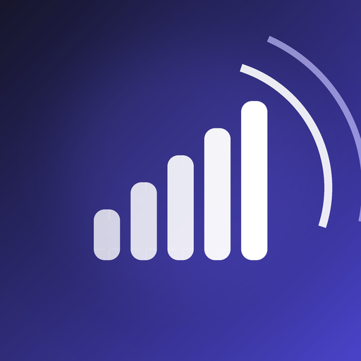
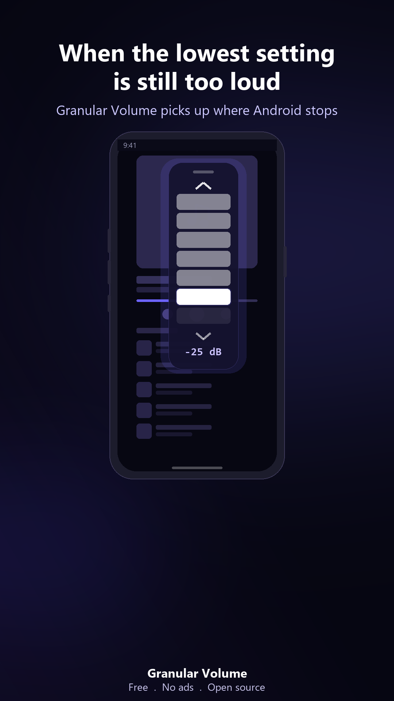
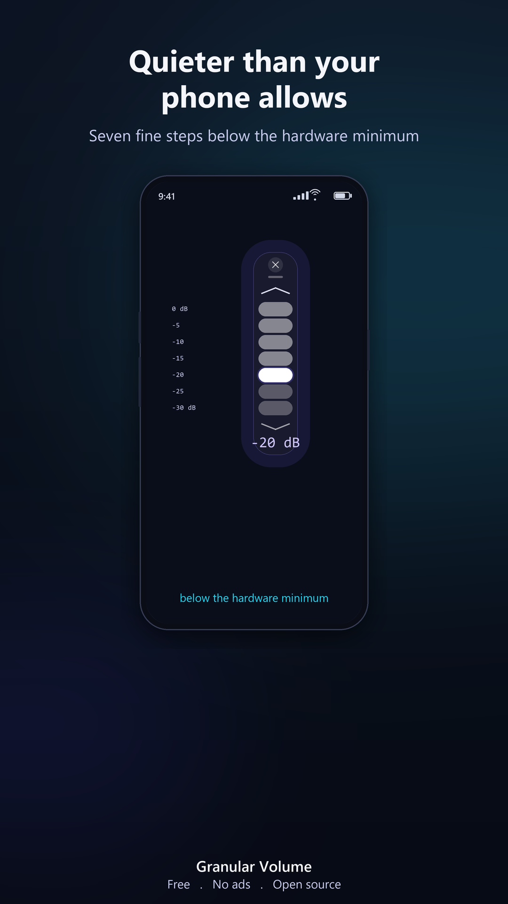
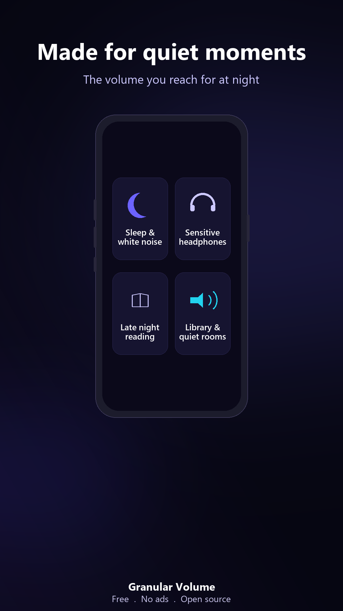

<div align="center">



# Granular Volume

**Volume below Android's minimum. A floating control that stays above any app.**

[](LICENSE)
[](#)
[](#)
[](#)
[](#)

</div>

---

## What it is

Android volume buttons are a blunt instrument. Lower your music and your ringtone drops with it. The lowest audible hardware step is often still too loud for a quiet room.

Granular Volume adds a software attenuation layer that inserts finer volume steps below the lowest hardware notch, and puts the control in a small floating volume control that stays above any app. Drag it anywhere on screen, tuck it to an edge, or close it with one tap.

No ads. No tracking. No account. Nothing collected.

## Features

- **Fine grained attenuation** from 0 dB (pass through) down to about -30 dB in steps, applied to the global output mix.
- **Floating overlay** that sits above any app, draggable to any position and persisted across restarts.
- **Quick Settings tile** — toggle the overlay on or off from the notification shade without opening the app.
- **One tap dismiss** and a clean, native feeling control surface.
- **Auto start on boot** so the control is ready when you need it.
- **Lightweight**, single purpose, written in pure Kotlin with no Compose runtime.

## How it works

The attenuation is produced by an Android audio effect attached to the global output session, with a graceful fallback chain so it behaves predictably across OEMs:

1. **`DynamicsProcessing`** (API 28+) is the primary engine. The output gain stage gives clean, flat spectrum attenuation across all channels.
2. **`LoudnessEnhancer`** is the fallback when DynamicsProcessing is unavailable at runtime.

A foreground `Service` owns the effect and the overlay for the full lifetime of the session, with the effect created once and released deterministically in `onDestroy()`. The service is declared as `specialUse`, since it maintains a real time audio effect and a floating control while the user listens to media in other apps, rather than playing media itself.

## Screenshots

<table>
<tr>
<th>Setup</th><th>Overlay</th><th>In use</th>
</tr>
<tr>
<td></td>
<td></td>
<td></td>
</tr>
</table>

## Demo

<a href="https://www.youtube.com/watch?v=_k1cdc7uWMI">

</a>

[Watch the 24-second demo on YouTube](https://www.youtube.com/watch?v=_k1cdc7uWMI)

## Project structure

```
android/                        Android project (Gradle root)
  app/
    src/main/
      AndroidManifest.xml
      java/com/granularvolume/
        MainActivity.kt          Permission flow and service launcher
        service/                 Foreground service, lifecycle owner
        audio/                   Effect strategy: DynamicsProcessing + LoudnessEnhancer
        overlay/                 WindowManager overlay, drag and bounds logic
        receiver/                Auto start on boot
        util/                    Permission checks and SharedPreferences wrapper
      res/                       Layouts, drawables, themes, strings
    build.gradle.kts
  build.gradle.kts
  settings.gradle.kts
store-assets/                   Store icon, feature graphic, screenshots, privacy policy
video/assets/                   Promo and card source files
```

## Building from source

Requirements: JDK 17 and the Android SDK (compileSdk 35).

```bash
cd android

# Debug APK (installs alongside the Play build, applicationId suffix .debug)
./gradlew assembleDebug

# Release bundle (requires your own signing config, see below)
./gradlew bundleRelease
```

### Signing

Release signing reads from a `local.properties` file that is never committed. Create your own keystore and add:

```properties
keystore.path=/absolute/path/to/your-release.jks
keystore.storePassword=...
keystore.keyAlias=...
keystore.keyPassword=...
```

The debug build needs no signing setup and is the recommended loop for local testing.

## Permissions

| Permission | Why |
|---|---|
| `SYSTEM_ALERT_WINDOW` | Draw the floating volume control over other apps. Granted manually in system settings. |
| `MODIFY_AUDIO_SETTINGS` | Apply the audio attenuation effect. |
| `FOREGROUND_SERVICE` / `FOREGROUND_SERVICE_SPECIAL_USE` | Keep the effect and overlay alive reliably. |
| `RECEIVE_BOOT_COMPLETED` | Restore the control after a reboot. |
| `POST_NOTIFICATIONS` | Show the foreground service notification (Android 13+). |

The overlay permission cannot be granted at runtime by the app. The setup screen guides you to the system toggle.

## Contributing

Issues and pull requests are welcome. Please keep changes focused, match the surrounding Kotlin style, and describe device and Android version when reporting behaviour.

## License

Granular Volume is free software, licensed under the **GNU General Public License v3.0**. See [LICENSE](LICENSE) for the full text. You are free to use, study, share, and modify it, provided derivative works remain under the same license.
